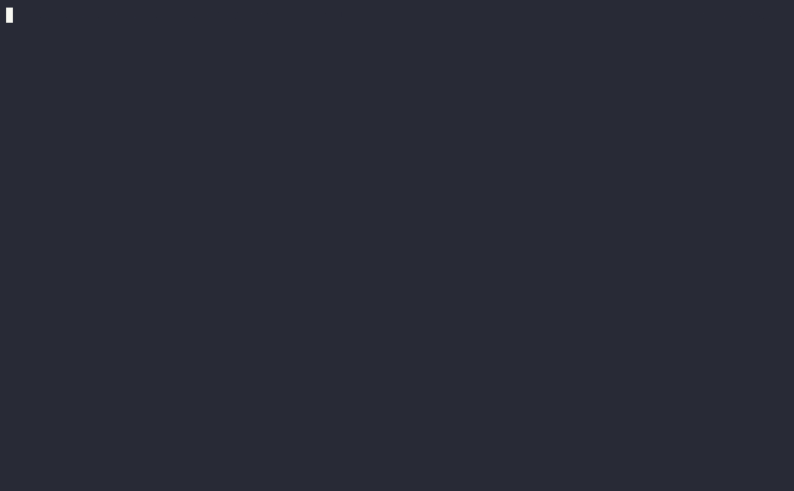

# kcDocGen  
  
A simple README generator for source code documentation.  
  
`kcdocgen` is a shell function that extracts all comments beginning with `#|`   
from an input file, and writes the content out to a README file.   
  
This allows you to write Markdown documentation directly in your source code.   
See the code comments in `kcdocgen.sh` for an example.    
  
## Setup  
  
```sh
kcScriptUrl="https://raw.githubusercontent.com/CaseyLabs/kcUtils/main/utils/kcDocGen/kcdocgen.sh"
curl -s ${kcScriptUrl} > kcdocgen
chmod +x kcdocgen
sudo cp kcdocgen /usr/local/bin/
```  
  
## Usage  
  
```sh
kcdocgen input_file
```  
  
## Example  
  
Example: `kcdocgen mycode.py`  
  
Let's say you have a Python file called `mycode.py` with the following content:  
  
```python  
#| # Example  
#| This is an example of text we want to include in the README.  
#|  
#| ## Usage  
#|  
#| ```python    
#| python example.py    
#| ```  
#|  
#| ## Output  
#| Hello, World!  

print("Hello, World!")  
print("Don't include this code in the readme!")  

# This comment won't be added to the readme because it 
# is a regular comment...
print("Last line!")  
```    
  
`kcdocgen mycode.py` will parse every line for `#|` and generate a README file   
from those comments. The genereated readme file content will look like:  
  
<pre>
# Example

This is an example of text we want to include in the README. 

## Usage

```python  
python example.py  
```

## Output

Hello, World!
</pre>

The README file will be saved as `readme_mycode.py.md` in the current folder.

## Demo

